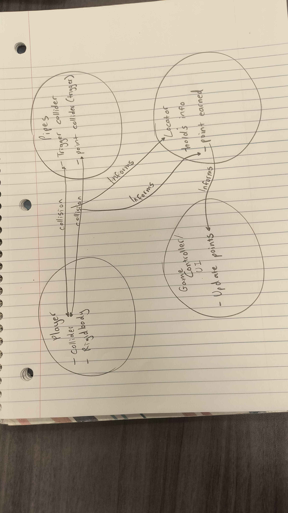

# GDIM32 In Class Activities

## W1

### Activity 1
- Test your game on the itch page mutiple times to see if there are any errors
- Test the itch link before submitting

### Activity 2
- Q1. 10
- Q2. 2 
- Q3. prints "hello world" to the console every frame 
- Q4. Monobehavior 
- Q5. prints "x = 10" to the console at the start of the game 
- Q6. arguments displays certain infomrtion, and a parameters that tell the method the data being used to complete the fuction
- Q7. Transform.translate does not have the variable that it would translate, there the transformation will cause an error
- Q8. _playerTransform. should be added in front of the translation to communicate to the function what is being translated

### Activity 3
https://docs.google.com/document/d/1MR5s2MD1t6kFIP1PlwggtskA_hNJPmX335sJPT-4Uuw/edit?usp=sharing

## W2

### Activity 1
 

### Activity 2
[First commit on MG2](https://github.com/UCI-GDIM32-W25/mg2-oop-review-romarica-droid/commit/32d7cbb37138b39732ca9b5764cbde548ee4f539)

I was able to set up the enviroment with a gronud, player, and a coin prefab within the prefab folder. I also started working on the jumping for the player as well as setting up my game controller.'

## W3

### Activity 0-2 
Partner: Evrin Lee

### Activity 3

## W4

### Activity 0
Partner: Evrin Lee

### Activity 1
When adding more locators, the information was sent alot slower between the different seaguls.

### Activity 2

### Activity 3
[MG4 repository](https://github.com/romarica-droid/HW4)

## W4

### Activity 1 
I like how the Use of IBreakable and Item class have alot of potiental to be modified between each item. However, i feel like rewritting the damage class is redudant and will become grueling to reimpliment. I would make the item class calculate damage and make it virtual, so if the item did not need it to be edited it can stay, or be edited by the programmer.

### Activity 2
For the Model, the EnemyStats and ItemW5Demo2 scripts hold all the information about the certain items and enemy interactions for the game to use. For the View element of the demo, the InventoryUI and DialogueBubble scripts all display the backend code running. For the Controller element for the demo, The PlayerW5Demo2 class and EnemyW5Demo2 both manage the movement and proximity systems that will display the dialogue bubbles. 

### Activity 3
Looking at Willow's desired game, one of the best design patterns that could be used for the game is ScriptableObjects. The has a massive amount of various items and npc interactions that if they were hard coded, would become redudant and time consuming to produce with C# Alone. However, by using Scriptable objects, a majority of the games items and npc interactions can not only be easily asseciable by the programmer, but also have room for the designer and artist to adjust.

### Activity 4
Attendance: Romarick Anderson, Evrin Lee, Ransom Liu
[Final Project Final Draft Documment](https://docs.google.com/document/d/1yaFfMOREKQ-uBypP_ClrG3IaEjA-R7tuW3AvkSeLdno/edit?usp=sharing)
