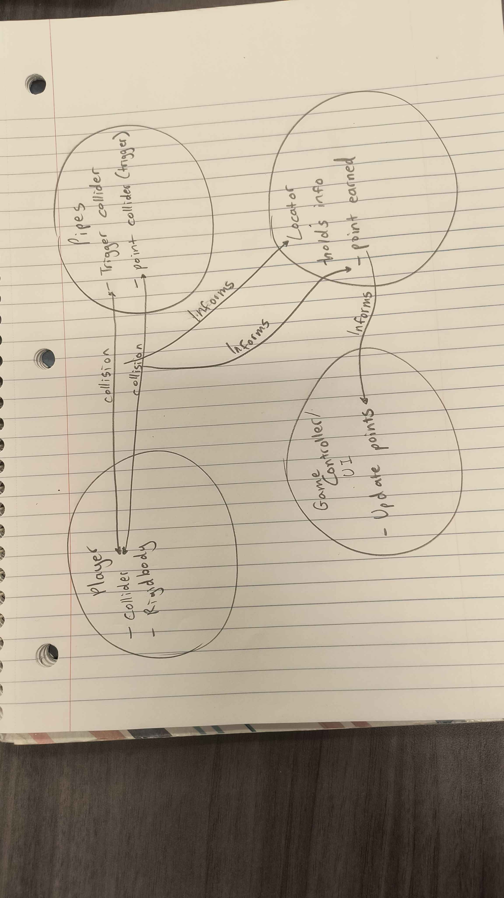

# GDIM32 In Class Activities

## W1

### Activity 1
- Test your game on the itch page mutiple times to see if there are any errors
- Test the itch link before submitting

### Activity 2
- Q1. 10
- Q2. 2 
- Q3. prints "hello world" to the console every frame 
- Q4. Monobehavior 
- Q5. prints "x = 10" to the console at the start of the game 
- Q6. arguments displays certain infomrtion, and a parameters that tell the method the data being used to complete the fuction
- Q7. Transform.translate does not have the variable that it would translate, there the transformation will cause an error
- Q8. _playerTransform. should be added in front of the translation to communicate to the function what is being translated

### Activity 3
https://docs.google.com/document/d/1MR5s2MD1t6kFIP1PlwggtskA_hNJPmX335sJPT-4Uuw/edit?usp=sharing

## W2

### Activity 1
 

### Activity 2
[First commit on MG2](https://github.com/UCI-GDIM32-W25/mg2-oop-review-romarica-droid/commit/32d7cbb37138b39732ca9b5764cbde548ee4f539)

I was able to set up the enviroment with a gronud, player, and a coin prefab within the prefab folder. I also started working on the jumping for the player as well as setting up my game controller.'

## W3

### Activity 0-2 
Partner: Evrin Lee

### Activity 3

## W4

### Activity 0
Partner: Evrin Lee

### Activity 1
When adding more locators, the information was sent alot slower between the different seaguls.

### Activity 2

### Activity 3
[MG4 repository](https://github.com/romarica-droid/HW4)

## W5

### Activity 1 
I like how the Use of IBreakable and Item class have alot of potiental to be modified between each item. However, i feel like rewritting the damage class is redudant and will become grueling to reimpliment. I would make the item class calculate damage and make it virtual, so if the item did not need it to be edited it can stay, or be edited by the programmer.

### Activity 2
For the Model, the EnemyStats and ItemW5Demo2 scripts hold all the information about the certain items and enemy interactions for the game to use. For the View element of the demo, the InventoryUI and DialogueBubble scripts all display the backend code running. For the Controller element for the demo, The PlayerW5Demo2 class and EnemyW5Demo2 both manage the movement and proximity systems that will display the dialogue bubbles. 

### Activity 3
Scenario 1:
- Mvc
    - seperate the data for points gained and note speed and whatnot (Model)
    - Sprites and UI as well as visual Indicators (View)
    - Carries out how the notes move and how the player interacts with them (Controller)

Scenario 2:
- MVC
    - Player, points, money, and stats for weapons and abilites (Model)
    - UI, scoreboard, and other visual results of the game (View)
    - Carrying out use of abilites, damage players, creating sheilds (Controller)

Scenario 3:
- State machine
    - Player has several states for running, planting, trading, and several other parts of the game that can have seperate states
    - Animations can be tied to the states to make it easier for programmer 

### Activity 4
Attendance: Romarick Anderson, Evrin Lee, Ransom Liu

[Final Project Final Draft Documment](https://docs.google.com/document/d/1yaFfMOREKQ-uBypP_ClrG3IaEjA-R7tuW3AvkSeLdno/edit?usp=sharing)

## W6

### Activity 1
[Notes for 2/10/2026](https://docs.google.com/document/d/1nAKMCzUKeBY0UssbaXUPBFRLgyss7vPdK5rcIJ2h9To/edit?usp=sharing)

### Activity 2
Attendance: Romarick Anderson, Ransom Liu
Evrin Lee - VDGC Game Developer week
[Final Project Repository](https://docs.google.com/document/d/1yaFfMOREKQ-uBypP_ClrG3IaEjA-R7tuW3AvkSeLdno/edit?usp=sharing)

## W7

### Activity 1
[Notes for 2/17/2026](https://docs.google.com/document/d/18Pfl0hIJuI0dH92n2WbN7UnkOnOmx5z48IvF9tPr3q4/edit?usp=sharing)

### Activity 2 
Attendance: Romarick Anderson, Evrin Lee
Ransom Liu - sick (contacted us)

### Activity 3

### Activity 4
[Trello Board for Progress](https://trello.com/b/dcBIyEk5)

### Activity 5
[Player movement commit](https://github.com/lindenreid/GDIM32-Final/commit/e393bf17ba38f063457d65fb8589df95ed0838d0)

For this commit, i created a script with the base of the player movement. The class takes a navmesh agent and uses input axis to move the player based on the the WASD keys.

## W8

### Activity 1
[Notes for 2/24/2026](https://docs.google.com/document/d/16LoE-kBcWZPuANjL0weMd1aof7Cl5XFK5KR1eIY4KRw/edit?usp=sharing)

### Activity 2
Attendance: Romarick Anderson, Evrin Lee, Ransom Liu

### Activity 3
Playtesting goal: everything we did for this week functions (movement, lion chasing, and can click on door to interact with it(it will disappear))

Playtesting captain: Evrin

Playtesting notes:
- collision w the rocks is weird rn
- collision w lion is weird rn
- lion trigger distance could be bigger
- lion might be a little too fast

### Activity 4
Current Personal Task:
Pigeon Dialouge 

Function: When a player clicks on a pigeon, a dialouge box with a hint will appeasr

### Activity 5
[Personal Commit](https://github.com/random0624/GDIM32-Final/commits/main/)

## W9

### Activity 1
[Notes for 2/24/2026](https://docs.google.com/document/d/1IuEaejt0nQmWYapGGrJkLWH8mwGZw-pncMTisUIbOfk/edit?usp=sharing)

### Activity 2
Attendance: Romarick Anderson, Evrin Lee, Ransom Liu

### Activity 3
Playtesting captain: Evrin Lee

Playtesting goal: player can move around and experience all currently existing interaction without confusion, or running into bugs

Notes:
- lion kinda buggy
- make it more obvious where the pigeon is (add spotlight)
- add all the lions (make them more threatening)
- place all collectables & doors in places that actually make the game fun

### Activity 4
The main mechanics of the game are nearly complete, which is a majority of the difficult task that are complete. A new batch of smaller task a still needed, as well as developing the enclosure with puzzles. We still need several sound effects as well as well as the bush hiding mechanic. We are a little behind but have gotten through the tougher start of the game.

### Activity 5
[Personal Commit](https://github.com/random0624/GDIM32-Final/commit/5b86ef166e9d0802261c5aee3a9a9889260fe243)

Function: Within the door script, a new TMP_text variable will is linked to a hidden on the player UI. A new clicker system is added that will focus on locater sending information, which will be updated later.

## W10

### Activity 1
Attedance: Evrin Lee, Romarick Anderson

### Activity 2 
Playtesting Captain: Evrin Lee

Playtesting goal: See if lion significantly smoother than last time

Notes:

- The lion doesn't spasm like last time but it sometimes gets stuck in the rocks
- There are places (especially between the rocks and the fence) where the player falls through
- Player movement, inventory system, dialogue interaction works smoothly

### Activity 3

Currently, we are 70% done with our game, and are adding more envirmonet changes to our game. We are projected to finish early, but will need to take time to finish the newer systems later in the game.

### Activity 4
[Current Commit](https://github.com/random0624/GDIM32-Final/commit/c5d718c993b76fe20f6ab36d4996835ac2864efa)

Not only did remake the door to work on a locator system now, i was able to change the pigeon text depending on what part of the sequence of code the player is on (after mutiple merge conflict ;_;).

